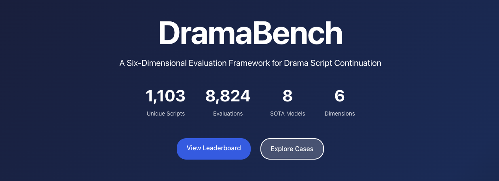

# DramaBench

<div align="center">



**A Six-Dimensional Evaluation Framework for Drama Script Continuation**

[]()
[]()
[]()

[🌐 Web Demo](https://dramabench.pages.dev/) • [📊 Leaderboard](#leaderboard) • [📖 Documentation](#documentation) • [💾 Dataset](#dataset)

</div>

---

## 📋 Table of Contents

- [Overview](#overview)
- [Quick Start](#quick-start)
- [Project Components](#project-components)
- [Web Demo](#web-demo)
- [Dataset](#dataset)
- [Evaluation Framework](#evaluation-framework)
- [Leaderboard](#leaderboard)
- [Documentation](#documentation)
- [Contributing](#contributing)
- [Citation](#citation)
- [License](#license)

---

## 🎯 Overview

**DramaBench** is a comprehensive benchmark for evaluating drama script continuation capabilities of large language models. It provides:

### Core Components

- 🌐 **Interactive Web Demo** - Explore model performance and case studies
- 💾 **Large-Scale Dataset** - 1,103 drama scripts with human annotations
- 📊 **Evaluation Framework** - 6 independent dimensions with rigorous metrics
- 🏆 **Model Leaderboard** - Compare 8 SOTA language models
- 📝 **Case Studies** - 24 curated examples with detailed analysis

### Six Evaluation Dimensions

1. **Format Standards** (Rule-based) - Screenplay format compliance
2. **Narrative Efficiency** (LLM-labeled) - Story progression effectiveness
3. **Character Consistency** (LLM-labeled) - Character voice and behavior
4. **Emotional Depth** (LLM-labeled) - Emotional arc development
5. **Logic Consistency** (LLM-labeled) - Factual coherence and continuity
6. **Conflict Handling** (LLM-labeled) - Conflict development quality

### Key Statistics

- **1,103** unique drama scripts
- **8,824** total evaluations (1,103 scripts × 8 models)
- **8** state-of-the-art language models
- **6** independent evaluation dimensions
- **252** statistical significance tests (65.9% significant)
- **24** curated case studies

---

## 🚀 Quick Start

### Prerequisites

- Python 3.10+
- Web browser (Chrome, Safari, Firefox, or Edge)

### Launch Web Demo

**Method 1: One-Click Start (Easiest)**

```bash
cd DramaBench
./start_demo.sh
```

This will automatically:
- ✅ Start a local HTTP server on port 8000
- ✅ Open the demo in your default browser
- ✅ Navigate to http://localhost:8000

**Method 2: Manual Server Start**

```bash
cd DramaBench

# Using uv (if available)
uv run python -m http.server 8000

# Or using Python 3 directly
python3 -m http.server 8000

# Then open http://localhost:8000 in your browser
```

### ⚠️ Important Note

Due to browser CORS restrictions, you **must** use a local HTTP server to view the demo. Opening HTML files directly (`file://` protocol) will cause data loading errors.

---

## 🧩 Project Components

### 1. Web Demo

An interactive, Apple-inspired web interface for exploring evaluation results.

**Features:**
- 📊 Interactive leaderboard with dimension filters
- 📝 Case studies explorer with 24 examples
- 🎨 Premium dark gradient design
- 📱 Fully responsive (mobile/tablet/desktop)
- ⚡ Pure HTML/CSS/JavaScript (no frameworks)

**Pages:**
- `index.html` - Main landing page
- `web/leaderboard.html` - Model rankings
- `web/cases.html` - Case studies browser

[→ View Web Demo Documentation](#web-demo)

### 2. Dataset

**Coming Soon**: The complete DramaBench dataset will include:

- Drama script contexts and continuations
- Human annotations and quality labels
- Multi-dimensional evaluation metrics
- Error taxonomy and classification
- Model outputs from 8 SOTA models

### 3. Evaluation Code

**Coming Soon**: Full evaluation pipeline including:

- Six-dimensional evaluation framework
- LLM-based labeling prompts and scripts
- Statistical analysis tools
- Visualization generation
- Reproducibility scripts

---

## 🌐 Web Demo

### Features

**Interactive Leaderboard**
- Filter by dimension (overall + 6 dimensions)
- Expandable model details with per-dimension scores
- Rank badges (gold/silver/bronze)
- Real-time filtering and sorting

**Case Studies Explorer**
- 24 curated success/failure examples
- Filter by dimension and type
- Script excerpts with metrics
- Analysis insights and takeaways

**Design**
- Apple-inspired UI with premium dark gradients
- SF Pro font family (system fonts)
- Glassmorphism effects
- Smooth animations and transitions
- Fully responsive layout

### Technologies

- Pure HTML/CSS/JavaScript (no frameworks)
- Apple Design Language principles
- CSS Grid & Flexbox layouts
- Backdrop filters for glassmorphism
- CSS animations for smooth transitions

### Data Processing

Regenerate web demo data from source:

```bash
cd DramaBench
uv run python web/scripts/process_data.py
```

This processes:
- 6 dimension metrics CSV files (8,824 evaluations)
- 24 case studies with detailed analysis
- Generates web-friendly JSON in `web/data/`

---

## 💾 Dataset

### Dataset Overview

**Coming Soon**: The DramaBench dataset will be released publicly.

**Planned Contents:**
- 1,103 drama script contexts
- Model-generated continuations (8 models)
- Human annotations and quality assessments
- Multi-dimensional evaluation metrics
- Error taxonomy classifications

**Format:** JSONL with structured metadata

**License:** To be determined

---

## 📊 Evaluation Framework

### Methodology

DramaBench uses a **hybrid evaluation system**:

1. **Rule-Based Analysis** (Format Standards)
   - 100% reproducible
   - Zero cost
   - Fountain syntax validation

2. **LLM-Based Labeling** (5 content dimensions)
   - Structured feature extraction
   - Statistical metric calculation
   - Not direct scoring

### Six Dimensions

| Dimension | Type | Key Metrics | Description |
|-----------|------|-------------|-------------|
| **Format Standards** | Rule-based | Format Error Rate, Novelization Index, Dialogue-Action Ratio | Screenplay format compliance |
| **Narrative Efficiency** | LLM-labeled | Effective Narrative Rate (ENR), Beats Per Page | Story progression effectiveness |
| **Character Consistency** | LLM-labeled | Out-of-Character Rate, Voice Distinctiveness | Character voice and behavior consistency |
| **Emotional Depth** | LLM-labeled | Arc Score, Complexity Ratio | Emotional arc development |
| **Logic Consistency** | LLM-labeled | Logic Break Rate, Context Coherence | Factual coherence and logical continuity |
| **Conflict Handling** | LLM-labeled | Conflict Score, Drop Rate | Conflict development and resolution |

### Validation

**Statistical Significance:**
- 252 Mann-Whitney U tests performed
- 166/252 comparisons significant (65.9% with FDR correction)
- Beats Per Page: Most differentiating (26/28 significant)

**Dimension Independence:**
- Mean absolute correlation: |r| = 0.020 (extremely low)
- Max correlation: |r| = 0.068 (Format ↔ Narrative)
- All dimensions capture distinct quality aspects

**Human-LLM Agreement:**
- Strong agreement on 3/5 dimensions
- Logic: r=0.48*** (Pearson correlation)
- Emotional Depth: κ=0.53 (Cohen's Kappa)
- Conflict: κ=0.42 (Cohen's Kappa)

---

## 🏆 Leaderboard

### Top 8 Models Evaluated

| Rank | Model | Provider | Overall Score |
|------|-------|----------|---------------|
| 🥇 1 | **GPT-5.2** | OpenAI | 0.960 |
| 🥈 2 | **GLM-4.6** | Zhipu AI | 0.930 |
| 🥉 3 | **Qwen3-Max** | Alibaba Cloud | 0.917 |
| 4 | **Claude Opus 4.5** | Anthropic | 0.888 |
| 5 | **MiniMax M2** | MiniMax | 0.869 |
| 6 | **DeepSeek V3.2** | DeepSeek | 0.856 |
| 7 | **Gemini 3 Pro** | Google DeepMind | 0.843 |
| 8 | **Kimi K2 Thinking** | Moonshot AI | 0.815 |

**Note:** Rankings may vary by dimension. See [web demo](web/leaderboard.html) for detailed per-dimension scores.

---

## 📚 Documentation

### Project Structure

```
DramaBench/
├── index.html                    # Main landing page
├── README.md                     # This file
├── start_demo.sh                 # One-click demo launcher
├── assets/
│   └── DramaBench_cover.png     # Project cover image
├── web/                          # Web demo
│   ├── leaderboard.html         # Model rankings page
│   ├── cases.html               # Case studies page
│   ├── css/
│   │   └── apple-style.css      # Apple-inspired CSS framework
│   ├── data/                    # Processed JSON data
│   │   ├── leaderboard.json     # Model rankings (14KB)
│   │   ├── case_studies.json    # 24 case studies (262KB)
│   │   └── statistics.json      # Overall statistics (3KB)
│   └── scripts/
│       └── process_data.py      # Data processing script
├── dataset/                      # [Coming Soon] Dataset files
├── evaluation/                   # [Coming Soon] Evaluation code
└── docs/                         # [Coming Soon] Additional documentation
```

### Browser Compatibility

Tested and optimized for:
- ✅ Chrome 90+
- ✅ Safari 14+
- ✅ Firefox 88+
- ✅ Edge 90+

### Common Issues

**Issue: "Error loading data"**

- **Cause**: Opening HTML files directly without HTTP server
- **Solution**: Use `./start_demo.sh` or `python3 -m http.server 8000`

**Issue: "Port 8000 already in use"**

- **Cause**: Another process is using port 8000
- **Solution**: Use a different port: `python3 -m http.server 8001`

---

## 🤝 Contributing

We welcome contributions to DramaBench! Areas for contribution:

- 🐛 Bug reports and fixes
- 📝 Documentation improvements
- 🎨 UI/UX enhancements
- 📊 New visualizations
- 🔧 Evaluation tools
- 💾 Dataset improvements

**How to Contribute:**

1. Fork the repository
2. Create a feature branch (`git checkout -b feature/amazing-feature`)
3. Commit your changes (`git commit -m 'Add amazing feature'`)
4. Push to the branch (`git push origin feature/amazing-feature`)
5. Open a Pull Request

---

## 📖 Citation

**Paper coming soon**. If you use DramaBench in your research, please cite:

```bibtex
@article{dramabench2026,
  title={DramaBench: A Six-Dimensional Evaluation Framework for Drama Script Continuation},
  author={[Authors]},
  journal={[Venue]},
  year={2026}
}
```

---

## 📄 License

This project is licensed under the MIT License - see the [LICENSE](LICENSE) file for details.

---

## 🙏 Acknowledgments

- **Apple Design Team** - Design inspiration
- **ACL Community** - Research support
- **Model Providers** - OpenAI, Anthropic, Google DeepMind, Alibaba Cloud, DeepSeek, MiniMax, Moonshot AI, Zhipu AI

---

## 📧 Contact

For questions, feedback, or collaboration opportunities:

- **Issues**: [GitHub Issues](https://github.com/IIIIQIIII/DramaBench/issues)
- **Email**: mas8069@foxmail.com
- **Twitter**: @mashijiann

---

<div align="center">

**Last Updated**: 2025-12-20 • **Version**: 1.0.0 • **Status**: ✅ Active

Made with ❤️ by the DramaBench Team

</div>
